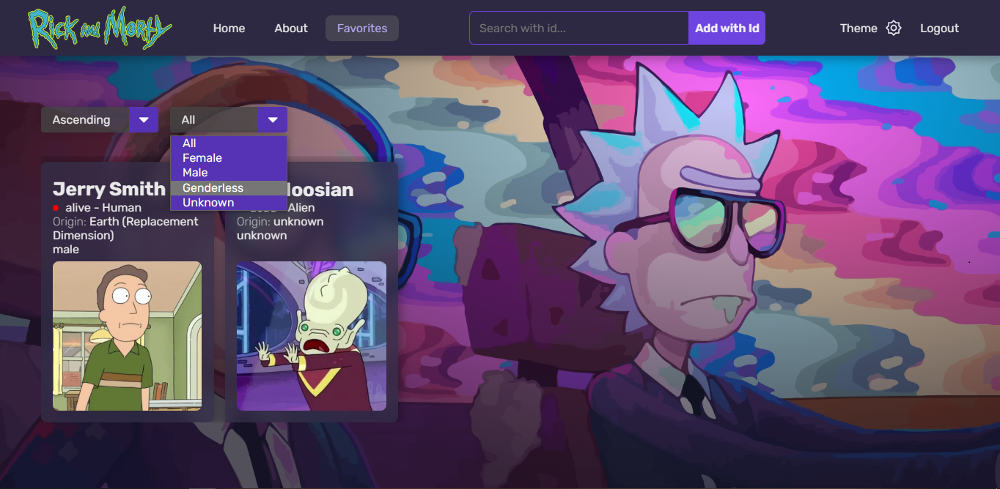

# Rick And Morty Character Search App

Welcome to the web application project!

This project consists of two parts: the client-side and the server-side.

## Screenshots

1. Homepage

2. Hover on a Character Card

3. Favorites page



## Client-Side

The client-side of the web application is built using React.js and Redux. It provides a user interface that allows users to view and interact with characters from the popular TV series "Rick and Morty". Users can search for a character by their ID and save their favorite characters, also can view character details.

### Project Structure

```plaintext
-- client
    -- src
        -- assets
        -- pages
        -- redux
        -- components
        -- utils
        -- index.js
        -- index.css
        -- App.js
        -- App.css
```

- **pages**: This directory contains the different pages or screens of the application, such as the home page, character details page, etc.
- **redux**: This directory contains the Redux-related files, including actions, reducers, and store configuration.
- **components**: This directory contains reusable components used throughout the application.
- **index.js**: The entry point file for the client-side application.
- **App.js**: The main component that sets up the routes and renders the application.

### Technologies Used

- React.js: A JavaScript library for building user interfaces.
- Redux: A state management library for JavaScript applications.

### Getting Started

To start using the client-side of the project, follow these steps:

1. Clone the repository to your local machine.
2. Navigate to the `client` directory.
3. Install the project dependencies by running `npm install`.
4. Start the development server by running `npm start`.
5. Open your browser and visit `http://localhost:3000` to access the web application.

## Server-Side

The server-side of the web application is built using Express.js. It provides REST API endpoints for the client-side to fetch character data.

### Project Structure

```plaintext
-- server
    -- src
        -- controllers
        -- routes
        -- utils
        -- index.js
```

- **controllers**: This directory contains the controller files that handle the logic for different API endpoints.
- **routes**: This directory contains the route files that define the API routes and their corresponding controller functions.
- **utils**: This directory contains utility files or helper functions used within the server.
- **index.js**: The entry point file for the server-side application.

### Technologies Used

- Express.js: A web application framework for building Node.js applications.

### Getting Started

To start using the server-side of the project, follow these steps:

1. Ensure you have Node.js installed on your machine.
2. Clone the repository to your local machine if you haven't already.
3. Navigate to the `server` directory.
4. Install the project dependencies by running `npm install`.
5. Start the server by running `npm start`.
6. The server will start running on `http://localhost:3001`.

## Contribution

If you would like to contribute to this project, you are welcome to submit pull requests with bug fixes, enhancements, or new features. Please make sure to follow the contribution guidelines outlined in the repository's `CONTRIBUTING.md` file.
Note: The CONTRIBUTING.md file will be created `soon`.

## Feedback

If you have any feedback, suggestions, or questions, please feel free to open an issue in the repository or contact us by email at [danielquispe.142@gmail.com](mailto:project@example.com).

We hope you enjoy using the web application!

Daniel R. Ricra Q.
